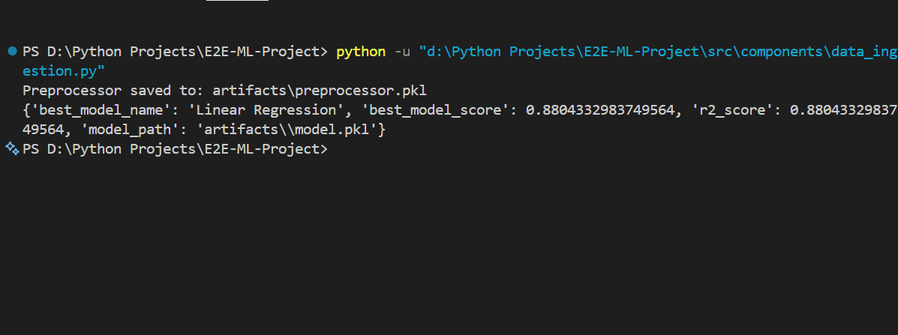

# E2E-ML-Project
End-to-end Machine Learning project for predicting student exam performance.

## Project Summary
This repository implements a complete ML pipeline for predicting student exam scores using demographic and academic features. The pipeline includes data ingestion, preprocessing, model training, and artifact saving for reuse.

The project demonstrates:
- Data ingestion from a CSV dataset
- Train/test split and raw data artifact creation
- Data preprocessing with sklearn pipelines and ColumnTransformer
- Model training and evaluation using multiple regressors
- Saving trained models and preprocessing pipelines as pickle artifacts
- Custom error handling and logging

## Dataset and Problem Statement
The dataset comes from Kaggle: https://www.kaggle.com/datasets/spscientist/students-performance-in-exams

Problem: Predict a student's `math_score` from features such as:
- gender
- race/ethnicity
- parental level of education
- lunch
- test preparation course
- reading_score
- writing_score

Dataset details:
- 1000 rows
- 8 columns

## Repository Structure
- `README.md` — Project overview and instructions
- `requirement.txt` — Python dependencies
- `setup.py` — Package metadata and installation
- `src/` — Main source package
  - `components/` — ML pipeline components
    - `data_ingestion.py` — dataset loading and train/test split
    - `data_transformation.py` — preprocessing pipeline and object saving
    - `model_trainer.py` — model selection, training, and persistence
    - `tempCodeRunnerFile.py` — temporary runner file (not part of production flow)
  - `exception.py` — custom exception handling
  - `logger.py` — logging setup
  - `utils.py` — helpers for saving/loading objects and model evaluation
  - `notebook/` — notebook artifacts and raw data
    - `data/stud.csv` — raw student performance CSV
- `artifacts/` — generated dataset and serialized artifacts
- `image.png` — screenshot placeholder shown in README

### Suggested folder tree
```
E2E-ML-Project/
├── README.md
├── requirement.txt
├── setup.py
├── src/
│   ├── components/
│   │   ├── data_ingestion.py
│   │   ├── data_transformation.py
│   │   ├── model_trainer.py
│   │   └── tempCodeRunnerFile.py
│   ├── exception.py
│   ├── logger.py
│   ├── utils.py
│   └── notebook/
│       └── data/stud.csv
├── artifacts/
│   ├── train.csv
│   ├── test.csv
│   ├── data.csv
│   ├── preprocessor.pkl
│   └── model.pkl
└── image.png
```

## Screenshots


## How It Works
1. `data_ingestion.py` reads the raw dataset and saves `train.csv`, `test.csv`, and `data.csv` artifacts.
2. `data_transformation.py` builds sklearn pipelines to preprocess numerical and categorical columns, transforms the data, and saves a serialized preprocessor object.
3. `model_trainer.py` trains multiple regression models, performs hyperparameter search, selects the best model, and saves it as `artifacts/model.pkl`.

## Setup and Run
1. Install dependencies:
   ```powershell
   python -m pip install -r requirement.txt
   ```
2. Run the ingestion and training flow:
   ```powershell
   python -u src\components\data_ingestion.py
   ```
3. Verify generated artifacts:
   - `artifacts/train.csv`
   - `artifacts/test.csv`
   - `artifacts/preprocessor.pkl`
   - `artifacts/model.pkl`

## Key Notes
- Uses sklearn `Pipeline` and `ColumnTransformer` to separate numerical and categorical preprocessing.
- Saves preprocessing and model objects so the pipeline can be reused later.
- Uses `CustomException` to wrap errors with traceback context.
- The project is designed to be modular, with separate concerns for ingestion, transformation, and training.

## Next Improvements
- Add a validation step or cross-validation fold selection
- Add feature engineering and feature importance reporting
- Expose a Flask API endpoint for predictions
- Add unit tests for each component
- Add a notebook or dashboard for EDA and model results
